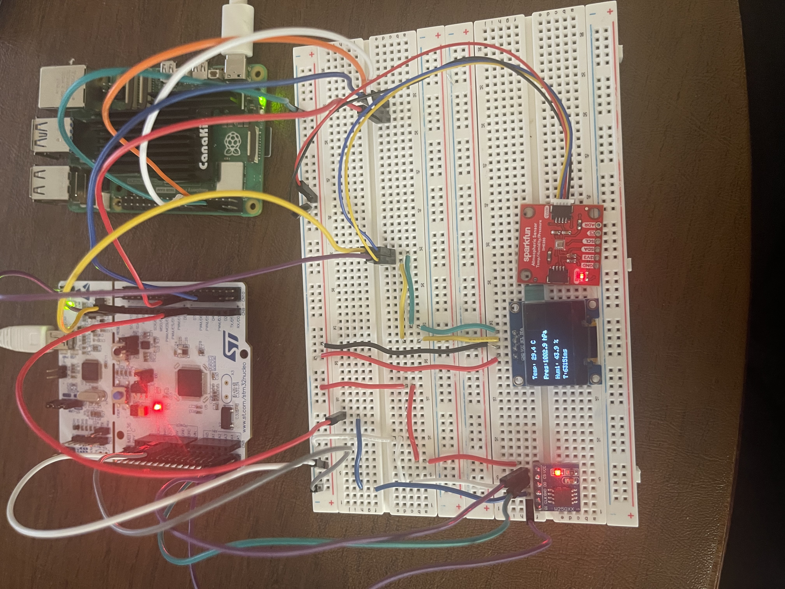

# RTOS-PriorityInversion-WD A FreeRTOS Application — STM32F446

A FreeRTOS application running on an STM32F446 Nucleo board. Five concurrent tasks manage a BME280 environmental sensor, SSD1306 OLED display, W25Q32 SPI flash storage, UART communication to a Raspberry Pi 5, and a software watchdog with per-task fault detection and automatic recovery.

Built in C++ with CMake. All RTOS primitives — mutexes, queues, event groups, task notifications — are chosen deliberately and wrapped in RAII guards.

---

## Hardware

| Component | Interface | Role |
|---|---|---|
| STM32F446RE Nucleo | — | Main MCU, 180 MHz Cortex-M4 |
| BME280 | I2C1, DMA | Temperature, pressure, humidity |
| SSD1306 OLED (128×64) | I2C1 | Live sensor display |
| W25Q32 SPI Flash (4MB) | SPI1 | Circular log storage |
| Raspberry Pi 5 | USART1 | Receives framed sensor data |

---
## Hardware Setup


## Task architecture

```
Priority 6 — WatchdogTask   osPriorityRealtime  256 words
Priority 5 — SensorTask     osPriorityHigh       512 words
Priority 4 — CommsTask      osPriorityAboveNormal 512 words
Priority 3 — StorageTask    osPriorityNormal     512 words
Priority 2 — DisplayTask    osPriorityBelowNormal 384 words
```

### Data flow

```
BME280 (I2C DMA)
    └── SensorTask
            ├── xQueueOverwrite ──► xDisplayQueue [1]  ──► DisplayTask  ──► OLED
            ├── xQueueSend ───────► xStorageQueue [16] ──► StorageTask  ──► W25Q32 flash
            └── xQueueSend ───────► xCommsQueue   [8]  ──► CommsTask    ──► UART ──► Pi 5
```

### Watchdog check-in

```
SensorTask  ──► bit 0 ─┐
DisplayTask ──► bit 1  ├──► xWDGroup (EventGroup) ──► WatchdogTask
StorageTask ──► bit 2  │        waits all bits, 6000ms timeout
CommsTask   ──► bit 3 ─┘        NVIC_SystemReset() on timeout
```

---

## RTOS primitives

| Primitive | Instance | Purpose |
|---|---|---|
| Mutex | `i2cMutex_` | Guards I2C1 bus between SensorTask and DisplayTask — uses priority inheritance to prevent inversion |
| Mutex | `spiMutex_` | Guards SPI1 bus owned by StorageTask |
| Queue (overwrite, depth 1) | `xDisplayQueue` | Display always sees the latest reading — never a stale backlog |
| Queue (standard, depth 16) | `xStorageQueue` | Buffers up to 16 readings during flash sector erase (~400ms) |
| Queue (standard, depth 8) | `xCommsQueue` | Buffers readings during UART transmission |
| Event group | `xWDGroup` | Four bits, one per task — watchdog waits for all simultaneously |
| Task notification | SensorTask TCB | DMA complete ISR wakes SensorTask with zero allocation overhead |

### Why a mutex and not a semaphore on I2C

SensorTask (priority 5) and DisplayTask (priority 2) share I2C1. A binary semaphore has no priority inheritance — if DisplayTask holds the bus and SensorTask blocks waiting for it, SensorTask (high priority) is stuck behind DisplayTask (low priority) indefinitely. A FreeRTOS mutex temporarily elevates DisplayTask to SensorTask's priority while it holds the bus, preventing the inversion.

### Why three separate queues instead of a shared struct

A shared global struct requires a mutex on every read. Three queues decouple producer from consumers — each consumer reads at its own rate. The sensor task never blocks on a send: `xQueueOverwrite` for display never blocks by design, `xQueueSend(..., 0)` for storage and comms drops the sample silently if the queue is full rather than stalling the sensor task.

---

## C++ design

All application code lives in `App/`. CubeMX-generated files in `Core/` and `Drivers/` are never modified except in `USER CODE` blocks.

### Task base class

```cpp
class Task {
public:
    Task(const char* name, uint32_t stackWords, osPriority_t priority);
    virtual ~Task() = default;
    TaskHandle_t handle() const { return handle_; }
protected:
    virtual void run() = 0;       // pure virtual — derived class implements
private:
    TaskHandle_t handle_ = nullptr;
    static void trampoline(void *param);  // bridges C linkage to C++ virtual call
};
```

`xTaskCreate` requires a plain C function pointer. The static trampoline is that function — it receives `this` as a `void*`, casts it back to `Task*`, and calls `run()`. No derived class ever calls `xTaskCreate` directly.

### Key decisions

All task instances are declared `static` in `app_main.cpp` — no heap allocation for task objects. Queues are created in `AppInit()` before `osKernelStart()` with `configASSERT` on every handle. Compile flags include `-fno-exceptions` and `-fno-rtti` — the C++ runtime is bare metal appropriate.

---

## Flash storage

W25Q32 is a 4MB SPI NOR flash with 16,384 pages of 256 bytes each. NOR flash can only be written after erasing, and the smallest erasable unit is a 4KB sector (16 pages).

### Circular log

Page 0 is reserved for the config sector. Log pages run from 1 to 16,383 then wrap back to 1. The write head is stored in page 0 with a magic number (`0xC0FFEE01`) so logging resumes from the correct position after a reboot.

```
Page 0:     [magic][writeHead][padding to 256 bytes]  ← config, never logged
Page 1:     [SensorReading_t][padding]                ← log start
Page 2:     [SensorReading_t][padding]
...
Page 16383: [SensorReading_t][padding]                ← wrap back to page 1
```

Before writing the first page of any new sector, that sector is erased. Sector erases take up to 400ms — the task yields with `vTaskDelay(1)` inside the busy-wait loop so other tasks continue running during the erase.

### SPI verification on boot

The JEDEC ID command (`0x9F`) returns three fixed bytes identifying the chip. StorageTask sends this command on startup and asserts the response is `EF 40 16` (Winbond W25Q32) before any read or write operation. If the response is wrong the task logs the failure over UART and halts rather than silently writing to the wrong device.

```
[SPI] JEDEC ID: EF 40 16
[SPI] OK
```

---

## Software watchdog

Each task sets one bit in `xWDGroup` at the end of every cycle. WatchdogTask calls `xEventGroupWaitBits` waiting for all four bits with a 6000ms timeout. If the timeout expires before all bits are set, the watchdog logs which tasks missed their check-in and calls `NVIC_SystemReset()`.

The 6000ms timeout accounts for the worst case storage task cycle — two sequential sector erases (config persist + log write) at 400ms each on top of the 1000ms sample rate.

WatchdogTask runs at `osPriorityRealtime` — the highest priority in the system. Even a runaway high-priority task that consumes all CPU time cannot prevent the watchdog from preempting it and detecting the hang.

### Watchdog demo output

Deliberate hang injected into DisplayTask after 5 cycles:

```
[WDT] Watchdog started
[Storage] page=101 T=25.2 P=1006.8 H=42.0
[WDT] all tasks OK
[Storage] page=102 T=25.2 P=1006.8 H=42.0
[WDT] all tasks OK
[Storage] page=103 T=25.2 P=1006.8 H=42.0
[WDT] all tasks OK
[Storage] page=104 T=25.2 P=1006.8 H=42.0
[WDT] all tasks OK
[Display] deliberately hanging...
[WDT] TIMEOUT — missed bits: 0x02
[WDT] DisplayTask hung
[WDT] Watchdog started
[Storage] page=105 T=25.2 P=1006.8 H=42.0
[WDT] all tasks OK
[Storage] page=106 T=25.2 P=1006.8 H=42.0
[WDT] all tasks OK
```

The page number continues from 105 after the reset — config persistence across reboots is confirmed.

### Python Script demo output

```

python ReadSensor.py

Opening /dev/serial0 @ 115200 baud...
Listening for frames (Ctrl-C to stop)...

[OK] T=31.81C  P=1002.36hPa  H=49.76%  t=68154ms
[OK] T=31.80C  P=1002.35hPa  H=49.74%  t=69155ms
[OK] T=31.80C  P=1002.34hPa  H=49.75%  t=70156ms
[OK] T=31.81C  P=1002.33hPa  H=49.73%  t=71157ms
[OK] T=31.81C  P=1002.36hPa  H=49.71%  t=72158ms
[OK] T=31.81C  P=1002.31hPa  H=49.75%  t=74159ms
[OK] T=31.82C  P=1002.31hPa  H=49.70%  t=75160ms
```


---

## Build

Requires `arm-none-eabi-gcc` toolchain and CMake 3.22+.

```bash
mkdir build && cd build
cmake -DCMAKE_TOOLCHAIN_FILE=../cmake/arm-none-eabi.cmake ..
make -j4
```

Flash with STM32CubeProgrammer or OpenOCD:

```bash
 openocd -f interface/stlink.cfg -f target/stm32f4x.cfg \
  -c "program RTOS-PriorityInversion-Wd.elf verify reset exit"
```

Monitor UART output (115200 8N1):

```bash
screen /dev/cu.usbmodem1103 115200
```

On Raspberry PI 5:

```bash
cd scripts && cd python
python ReadSensor.py

---

## File structure

```
App/
├── Inc/
│   ├── app_main.hpp        # queue/event group handles, AppInit declaration
│   ├── SensorReading.hpp   # shared data struct — no RTOS or HAL dependencies
│   ├── Task.hpp            # abstract base class with trampoline
│   ├── SensorTask.hpp
│   ├── DisplayTask.hpp
│   ├── StorageTask.hpp
│   ├── CommsTask.hpp
│   ├── WatchdogTask.hpp
│   └── watchdog_bits.hpp   # WD_BIT_* constants shared across all tasks
└── Src/
    ├── app_main.cpp        # queue creation, static task instances, AppInit
    ├── Task.cpp            # base class constructor and trampoline
    ├── SensorTask.cpp      # BME280 read, DMA notification, queue post
    ├── DisplayTask.cpp     # OLED render
    ├── StorageTask.cpp     # W25Q32 driver, circular log, config persistence
    ├── CommsTask.cpp       # UART framing and transmit
    ├── WatchdogTask.cpp    # event group monitor, reset on timeout
    └── cpp_support.c       # _sbrk, __cxa_pure_virtual, newlib syscall stubs
Core/                       # CubeMX generated — not modified
Drivers/                    # BME280 OLED CMSIS STM32 HAL — not modified
Middlewares/                # FreeRTOS — not modified
```

---

## Known limitations and future work

Config sector wear — `persistConfig()` erases and rewrites sector 0 after every flash write.

Writing the BME280 and OlED(SSD1306) Driviers in C++

No hardware IWDG — the software watchdog cannot fire if the FreeRTOS scheduler itself hangs. A production build would run the STM32 Independent Watchdog alongside the software watchdog, with the software watchdog kicking the hardware timer as its check-in mechanism.

Sector erase on critical path — the sector erase fires synchronously before writing the first page of each new sector. A pre-erase scheme — erasing the next sector immediately after entering the current one — would remove the erase latency from the write path entirely.

Single I2C bus — BME280 and SSD1306 share I2C1. The mutex protects correctness but the bus is a serialisation bottleneck. Separate buses or moving the OLED to SPI would allow concurrent access.

STM32 STOP mode between samples current draw measurement (active vs idle vs STOP), Power Budget consderations. 

Typed queue template wrapper, `onStart()` virtual method in task base class.

General C++ task base class improvements

Bluetooh For firmeware updates(maybe might be too out of scope), SQL log on PI5 (maybe might be too out of scope)

